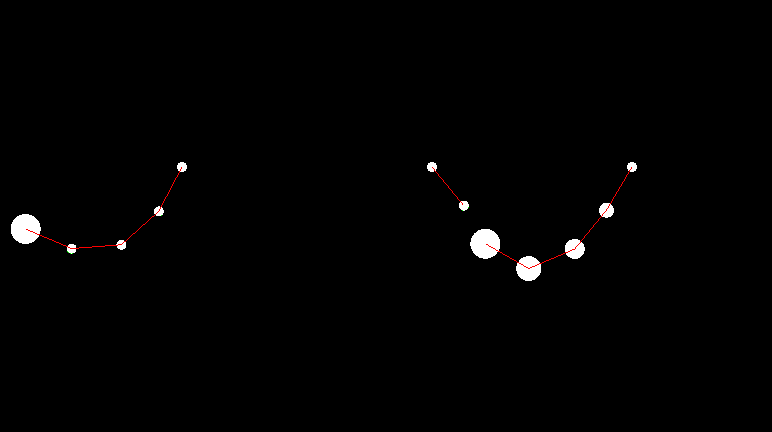

# Position-Based Dynamics
Basic PBD(position based dynamics) implementation using the SFML library in C++.

<div align="center">
  
</div>

## Prerequisites
- SFML library installed.
- A C++ compiler (e.g., g++).
- Make (for building the project).

0. prerequisites:
   ```bash
   # linux
   sudo apt install libsfml-dev
   
   # mac
   brew install sfml
   ```
1. Build the simulation by running:
   ```bash
   make all
   ```
2. Run the executable:
   ```bash
   ./pbd
   ```


